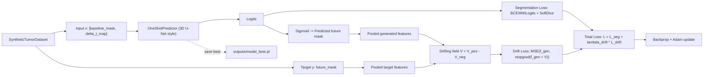

# Architecture Diagrams

Date: March 25, 2026  
Project: GMD tumor forecasting MVP (PyTorch)

## 1) Training Pipeline (MVP-1 with Optional Drifting Loss)

## 2) Inference Path (One-Shot)

## 3) Notes
- `use_drift_loss: false` gives MVP-0 behavior (segmentation-only baseline).
- `use_drift_loss: true` enables MVP-1 behavior (segmentation + drifting regularization).
- Both variants keep one-shot inference at test time.
